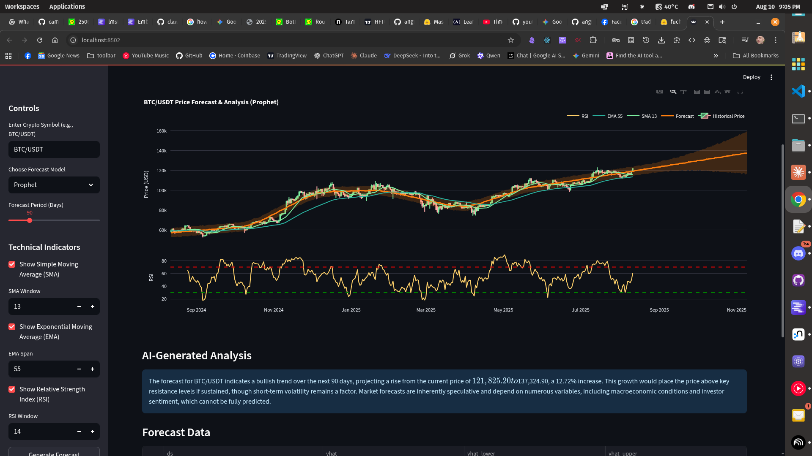

# AI-Assisted Crypto Forecaster

This project is an interactive web application that provides cryptocurrency price forecasts using the Prophet model and generates qualitative analysis of the forecast using a local Large Language Model (LLM) via LM Studio.

## Features

-   **Interactive UI:** A user-friendly interface built with Streamlit.
-   **Historical Data:** Fetches historical cryptocurrency data from public exchanges using `ccxt`.
-   **Time Series Forecasting:** Generates price forecasts using Facebook's Prophet model.
-   **AI-Powered Analysis:** Connects to a local LLM (via LM Studio) to provide a narrative interpretation of the forecast data.
-   **Interactive Charts:** Visualizes historical data and forecasts using Plotly.




## Project Structure

```
/crypto-forecast-app
|-- /data
|-- /notebooks
|-- /src
|   |-- __init__.py
|   |-- data_fetcher.py       # Handles fetching data from crypto exchanges
|   |-- forecasting.py        # Manages the Prophet forecasting model
|   |-- llm_integration.py    # Handles communication with the local LLM
|-- app.py                    # The main Streamlit application file
|-- requirements.txt          # Project dependencies
|-- README.md                 # This file
```

## Setup and Installation

### 1. Prerequisites

-   Python 3.8+
-   [LM Studio](https://lmstudio.ai/) installed and running with a downloaded model.

### 2. Clone the Repository

```bash
# This is a placeholder for where you would have your git repo
# git clone <your-repository-url>
# cd crypto-forecast-app
```

### 3. Create a Virtual Environment

It is highly recommended to use a virtual environment to manage project dependencies.

```bash
# Create the virtual environment
python -m venv venv

# Activate it
# On macOS/Linux:
source venv/bin/activate

# On Windows:
venv\Scripts\activate
```

### 4. Install Dependencies

Install all the required libraries from the `requirements.txt` file.

```bash
pip install -r requirements.txt
```

### 5. Run the LM Studio Server

1.  Open LM Studio.
2.  Select a model and load it.
3.  Navigate to the **Local Server** tab (usually marked with a `<->` icon).
4.  Click **Start Server**.

## How to Run the Application

With your virtual environment activated and the LM Studio server running, launch the Streamlit application from your terminal:

```bash
streamlit run app.py
```

The application should open in your default web browser.
