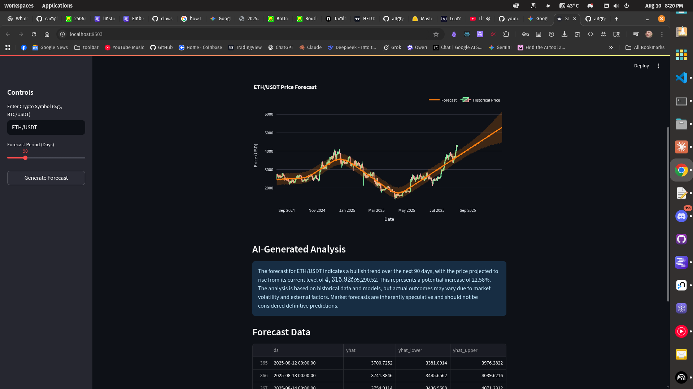

# AI-Assisted Crypto Forecaster

This project is an interactive web application that provides cryptocurrency price forecasts using the Prophet model and generates qualitative analysis of the forecast using a local Large Language Model (LLM) via LM Studio.

## Features

-   **Interactive UI:** A user-friendly interface built with Streamlit.
-   **Historical Data:** Fetches historical cryptocurrency data from public exchanges using `ccxt`.
-   **Time Series Forecasting:** Generates price forecasts using Facebook's Prophet model.
-   **AI-Powered Analysis:** Connects to a local LLM (via LM Studio) to provide a narrative interpretation of the forecast data.
-   **Interactive Charts:** Visualizes historical data and forecasts using Plotly.




  Development Plan: Automated Forecasting & Analysis

Done-  Phase 1: Technical Indicators Module
  First, I'll build the foundation for technical analysis.
   * Action: Create a new src/technical_analysis.py module.
   * Details: I will implement functions to calculate Simple Moving Average (SMA), Exponential Moving Average (EMA), and Relative Strength Index (RSI). I'll then
     update the Streamlit app to display these on the chart.

Done-  Phase 2: Expanding the Forecasting Toolkit
  Next, I'll add more models to compare against.
   * Action: Integrate ARIMA and Holt-Winters Exponential Smoothing from the statsmodels library.
   * Details: This will involve updating requirements.txt, installing the new dependency, and modifying src/forecasting.py to handle different model types.

  Phase 3: Backtesting Framework
  With multiple models available, we need a way to measure their performance.
   * Action: Create a src/backtesting.py module.
   * Details: This module will test the different forecasting models against historical data and score them using standard error metrics like Root Mean Squared Error
     (RMSE).

  Phase 4: Automated Model Selection
  This is the core of the new "intelligent" feature.
   * Action: Implement a "best model" selection process and UI checkbox for Auto-Testing
   * Details: Before generating a forecast, the application will automatically run a backtest on all available models. It will then select the one with the best score
     and use it for the final user-facing forecast, informing the user which model was chosen and why.

  Phase 5: Enhanced AI Analysis
  Finally, I'll feed this new, richer context to the LLM.
   * Action: Upgrade the prompt engineering in src/llm_integration.py.
   * Details: The prompt will now include not just the forecast, but also the chosen model, its backtesting accuracy, and the current technical indicator values (e.g.,
     "The RSI is at 75, indicating overbought conditions"). This will allow for a much more sophisticated and insightful analysis from the LLM.


## Project Structure

```
/crypto-forecast-app
|-- /data
|-- /notebooks
|-- /src
|   |-- __init__.py
|   |-- data_fetcher.py       # Handles fetching data from crypto exchanges
|   |-- forecasting.py        # Manages the Prophet forecasting model
|   |-- llm_integration.py    # Handles communication with the local LLM
|-- app.py                    # The main Streamlit application file
|-- requirements.txt          # Project dependencies
|-- README.md                 # This file
```

## Setup and Installation

### 1. Prerequisites

-   Python 3.8+
-   [LM Studio](https://lmstudio.ai/) installed and running with a downloaded model.

### 2. Clone the Repository

```bash
# This is a placeholder for where you would have your git repo
# git clone <your-repository-url>
# cd crypto-forecast-app
```

### 3. Create a Virtual Environment

It is highly recommended to use a virtual environment to manage project dependencies.

```bash
# Create the virtual environment
python -m venv venv

# Activate it
# On macOS/Linux:
source venv/bin/activate

# On Windows:
venv\Scripts\activate
```

### 4. Install Dependencies

Install all the required libraries from the `requirements.txt` file.

```bash
pip install -r requirements.txt
```

### 5. Run the LM Studio Server

1.  Open LM Studio.
2.  Select a model and load it.
3.  Navigate to the **Local Server** tab (usually marked with a `<->` icon).
4.  Click **Start Server**.

## How to Run the Application

With your virtual environment activated and the LM Studio server running, launch the Streamlit application from your terminal:

```bash
streamlit run app.py
```

The application should open in your default web browser.
